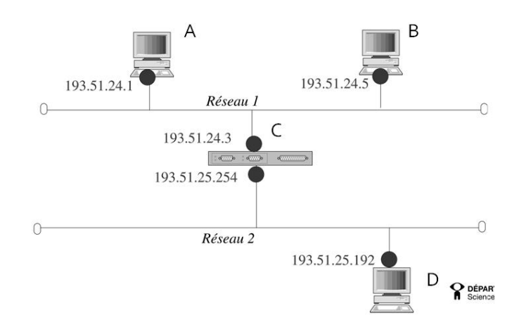
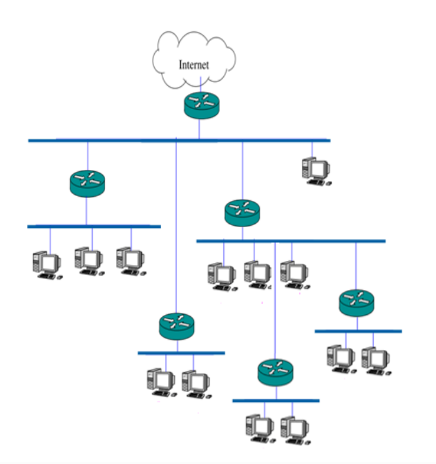
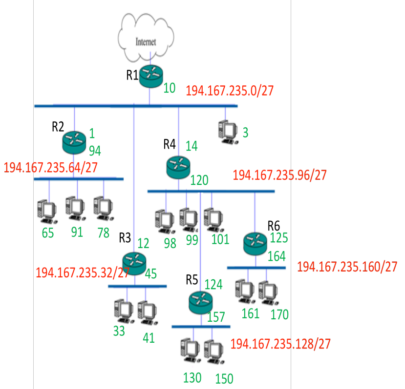

# Adresses privées :

- 10.0.0.0 à 10.255.255.255
- 172.16.0.0 à 172.31.255.255
- 192.168.0.0 à 192.168.255.255
- 169.254.0.0 à 169.254.255.255

# Classes d'adresses IP

- **Classe A** : commence par 0 (0.0.0.0 à 127.255.255.255; /8; 255.0.0.0)
- **Classe B** : commence par 10 (128.0.0.0 à 191.255.255.255; /16; 255.255.0.0)
- **Classe C** : commence par 110 (192.0.0.0 à 223.255.255.255; /24; 255.255.255.0)

# Exercice 1. Adresses IP sous forme binaire

Soient les 3 adresses IP suivantes, codées sur 32 bits, où les bits sont regroupés ici en octets pour en faciliter la lecture :

1.                                             10010011 11011000 01100111 10111110
2.                                             01101100 10100100 10010101 11000101
3.                                             11010110 01011100 10110100 11010001

Ecrivez chaque adresse en notation décimale pointée, déterminez sa classe, isolez sa partie classe+id, écrivez son adresse réseau en notation décimale pointée.

## Solution:

1. 10010011 11011000 01100111 10111110

   - Décimale pointée: 147.216.103.190
   - Classe: B (commence par 10)
   - Partie: 147.216 (les 16 premier bits)
   - Addresse réseau: 147.216.0.0

2. 01101100 10100100 10010101 11000101

   - Décimale pointée: 108.164.149.197
   - Classe: A (commence par 0)
   - Partie: 108 (les 8 premier bits)
   - Addresse réseau: 108.0.0.0

3. 11010110 01011100 10110100 11010001

   - Décimale pointée: 214.92.180.209
   - Classe: C (commence par 110)
   - Partie: 214.92.180 (les 24 premier bits)
   - Addresse réseau: 214.92.180.0

# Exercice 2. Adresses IP en notation décimale pointée

Soient les 4 adresses IP suivantes, exprimées selon la notation décimale pointée :

1.                                             139.124.5.25
2.                                             194.199.116.255
3.                                             12.34.56.78
    Calculez leur classe et en déduire leur adresse réseau en notation décimale pointée.

## Solution:

1. 139.124.5.25

   - Classe: B (127<139<192)
   - Adresse réseau: 139.124.0.0

2. 194.199.116.255

   - Classe: C (192<194<224)
   - Adresse réseau: 194.199.116.0

3. 12.34.56.78

   - Classe: A (12<127)
   - Adresse réseau: 12.0.0.0

# Exercice 3. Règles de décision

1.1 Ecrivez les adresses en binaires

1.2 Ecrivez les masques de sous-réseau en binaire

1.3 Appliquez la règle de décision de routage lorsque A communique avec B, C et D

## Solution:

### 1.1

| Nom        | IP Adresse Décimale | IP Adresse Binaire                  |
| ---------- | ------------------- | ----------------------------------- |
| A          | 193.51.24.1         | 11000001 00110011 00011000 00000001 |
| B          | 193.51.24.5         | 11000001 00110011 00011000 00000101 |
| C verse R1 | 193.51.24.3         | 11000001 00110011 00011000 00000011 |
| C verse R2 | 193.51.25.254       | 11000001 00110011 00011001 11111110 |
| D          | 193.51.25.192       | 11000001 00110011 00011001 11000000 |

### 1.2

Tous les adresses sont de classe C (192<193<223), donc la masque est /24

- **Masque décimale**: 255.255.255.0
- **Masque binaire**: 11111111 11111111 11111111 11111111 00000000

### 1.3

- A -> B: même réseau donc communication directe sur réseau 1

- A -> C: même réseau donc communication directe sur réseau 1

- A -> D: différents réseaux donc:

  - A envoie la trame au router/gateway sur son réseau (adresse du router = 193.51.24.3)
  - Le router C reçoit la trame, consulte sa table de routage, voit l'interface vers 193.51.25.0/24 (adresse 193.51.25.194) et réachemine la trame vers réseau 2
  - Ensuite, D reçoit la trame

# Exercice 4. Subdivision des adresses réseau en sous-réseaux (subnetting)

A partir de l'adresse 194.167.235.0, pour le réseau ci-contre,
construisez 6 adresses de sous-réseaux de taille identique
(remarque : déterminez B, n et b - cf. rappel en début de TD)

## Solution

### Paramètres

- On part de l'adresse 194.167.235.0. Premier octet = 194 ==> Classe C, masque par défault /24
- Donc il reste B = 8 bits pour id sous-réseau et station
- On veut n = 6 sous-réseaux de même taille. Donc, on choisi le plus petit b tel que 2^b > n ==> b = 3 bits

### Nouveau masque

- Préfixe: /24 + 3 = /27
- Masque décimale: **255.255.255.224**
- Masque binaire: `11111111 11111111 11111111 11100000`
- Taille du bloc (nombre d'addresses par sous-réseau) = 2^5 = 32

### 6 sous-réseaux

1. `194.167.235.0/27`

   - Addresse réseau: `194.167.235.0`
   - Plage hôtes utilisable: `194.167.235.1` --> `194.267.235.30`
   - Broadcast: `194.267.235.31`

2. `194.167.235.32/27`

   - Addresse réseau: `194.167.235.32`
   - Plage hôtes utilisable: `194.167.235.33` --> `194.267.235.62`
   - Broadcast: `194.267.235.63`

3. `194.167.235.64/27`

   - Addresse réseau: `194.167.235.64`
   - Plage hôtes utilisable: `194.167.235.65` --> `194.267.235.94`
   - Broadcast: `194.267.235.95`

4. `194.167.235.96/27`

   - Addresse réseau: `194.267.235.96`
   - Plage hôtes utilisable: `194.167.235.97` --> `194.267.235.126`
   - Broadcast: `194.267.235.127`

5. `194.167.235.128/27`

   - Addresse réseau: `194.267.235.128`
   - Plage hôtes utilisable: `194.167.235.129` --> `194.267.235.158`
   - Broadcast: `194.267.235.159`

6. `194.167.235.160/27`
   - Addresse réseau: `194.267.235.160`
   - Plage hôtes utilisable: `194.167.235.161` --> `194.267.235.190`
   - Broadcast: `194.267.235.191`

# Exercice 5. Tables de routage

Construire la table de routage pour les hôtes des différents sous-réseaux (hors routeurs)
Les hôtes du sous-réseau `194.168.235.96/27` devront pouvoir accéder aux sous-réseaux `194.168.235.160/27` et `194.168.235.128/27`

## Solution

### Table de routage pour les hôtes des différents sous-réseaux

| Hôte du réseau | Addresse du réseau |     Vers le réseau     | Passer par |  Router adresse   |
| :------------: | :----------------: | :--------------------: | :--------: | :---------------: |
|       1        |  `194.167.235.0`   |  `194.167.235.32/27`   |     R3     | `194.167.235.12`  |
|                |                    |  `194.167.235.64/27`   |     R2     |  `194.167.235.1`  |
|                |                    | `0.0.0.0/0 (Internet)` |     R1     | `194.167.235.10`  |
|                |                    |       `default`        |     R4     | `194.167.235.14`  |
|       2        |  `194.167.235.32`  |       `default`        |     R3     | `194.167.235.45`  |
|       3        |  `194.167.235.64`  |       `default`        |     R2     | `194.167.235.94`  |
|       4        |  `194.167.235.96`  |  `194.167.235.128/27`  |     R5     | `194.167.235.124` |
|                |                    |  `194.167.235.160/27`  |     R6     | `194.167.235.125` |
|                |                    |       `default`        |     R4     | `194.167.235.120` |
|       5        | `194.167.235.128`  |       `default`        |     R5     | `194.167.235.157` |
|       6        | `194.167.235.160`  |       `default`        |     R6     | `194.167.235.164` |

### Table de routage pour les hôtes des routeurs

| Hôte | Pour aller vers le réseau | Passer par adresse | Passer par router |
| :--: | :-----------------------: | :----------------: | :---------------: |
|  R1  |    `194.167.235.0/27`     |  `194.167.235.10`  |      directe      |
|      |    `194.167.235.32/27`    |  `194.167.235.12`  |        R3         |
|      |    `194.167.235.64/27`    |  `194.167.235.1`   |        R2         |
|      |   `0.0.0.0/0(Internet)`   |         --         |      directe      |
|      |         `default`         |  `194.167.235.14`  |        R4         |
|  R2  |    `194.167.235.0/27`     |  `194.167.235.1`   |      directe      |
|      |    `194.167.235.64/27`    |  `194.167.235.94`  |      directe      |
|      |    `194.167.235.32/27`    |  `194.167.235.12`  |        R3         |
|      |         `default`         |  `194.167.235.14`  |        R4         |
|  R3  |    `194.167.235.0/27`     |  `194.167.235.12`  |      directe      |
|      |    `194.167.235.32/27`    |  `194.167.235.45`  |      directe      |
|      |    `194.167.235.64/27`    |  `194.167.235.1`   |        R2         |
|      |         `default`         |  `194.167.235.14`  |        R4         |
|  R4  |    `194.167.235.0/27`     |  `194.167.235.14`  |      directe      |
|      |    `194.167.235.32/27`    |  `194.167.235.12`  |        R3         |
|      |    `194.167.235.64/27`    |  `194.167.235.1`   |        R2         |
|      |    `194.167.235.96/27`    | `194.167.235.120`  |      directe      |
|      |   `194.167.235.128/27`    | `194.167.235.124`  |        R5         |
|      |   `194.167.235.160/27`    | `194.167.235.125`  |        R6         |
|  R5  |   `194.167.235.128/27`    | `194.167.235.157`  |      directe      |
|      |   `194.167.235.160/27`    | `194.167.235.125`  |        R6         |
|      |         `default`         | `194.167.235.120`  |        R4         |
|  R6  |   `194.167.235.160/27`    | `194.167.235.164`  |      directe      |
|  R6  |   `194.167.235.128/27`    | `194.167.235.124`  |        R5         |
|  R6  |         `default`         | `194.167.235.120`  |        R4         |
