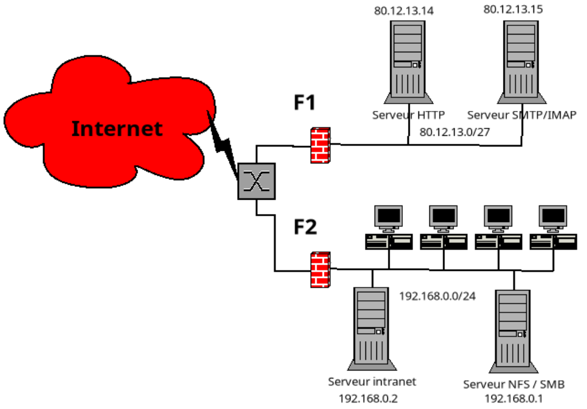

<center><h1>Pare-feu / Firewall</h1></center>

# Exercise 1



- 1.1: Pourquoi 2 réseaux et 2 firewall ?
- 1.2: Donnez les services que doivent laisser passer chaque pare-feu, avec leur sens (Internet vers réseau local ou réseau local vers Internet et les éventuelles restrictions.)
- 1.3: Comment se fait la mise à jour des données des serveurs ?
- 1.4: Un tel réseau avec ses deux firewall est-il une garantie contre les virus ?
- 1.5: Quels types d'adresses doit-on utiliser pour les machines derrière F1 ?


## Solution

### 1.1
* Deux réseaux car:
    * L'un est le DMZ (80.12.13.0/27) pour les serveurs publiques (HTTP, SMTP/IMAP).
    * L'autre est le LAN interne(192.160.0.0/24) pour les utilisateurs internes et les services.

* Deux pare-feu/firewalls car:
    * F1 protège le DMZ de l'Internet (permet seulement des spécifiques services publiques)
    * F2 protège le réseau interne du DMZ et de l'Internet

### 1.2
* F1 (Internet <-> DMZ):
    * Autoriser les connexions entrantes: HTTP (porte 80 ou 433) vers le serveur web, SMTP(25) ou IMAP(143/993)  
    * Refuser tout le reste
    * Autoriser les connexions sortantes: DNS, NTP, mise à jour du système d'exploitation si nécessaire
* F2 (DMZ <-> Réseau Interne):
    * Autoriser les connexions nécessaires: les administrateurs LAN accédant aux serveurs DMZ via SSH/HTTPS
    * Refuser le traffic de la DMZ vers LAN (pas d'accès direct des serveurs publiques aux PC privés)

### 1.3
Les mises à jour peuvent être effectuées:
* Les admins se connectent via SSH/HTTPS depuis le LAN et via F2
* En autorisant temporairement les connexions sortantes des serveurs pour récuperer les mises à jour (apt/yum)

### 1.4
Ce réseau garantit-il une protection contre les virus ?

==> Non, les pare-feu réduisent la surface d'attaque, mais ne bloquent pas complètement les malwares.

==> Il faut un anti-virus, un système de détection d'intrusion et la sensibilisation des utilisateurs.

### 1.5 
Quels types d'adresses doivent être utilisés derrière F1 ?

==> Adresse IP publique (comme 80.12.13.x) pour les serveurs DMZ, car ils doivent être accessibles depuis Internet.


# Exercise 2

## F1 – Protecting DMZ from Internet
```bash
# Default: drop everything
iptables -P INPUT DROP
iptables -P FORWARD DROP
iptables -P OUTPUT ACCEPT  # servers may need updates

# Allow established connections (responses)
iptables -A INPUT -m state --state ESTABLISHED,RELATED -j ACCEPT

# Allow NEW connections for public services
iptables -A INPUT -p tcp --dport 80 -m state --state NEW -j ACCEPT    # HTTP
iptables -A INPUT -p tcp --dport 443 -m state --state NEW -j ACCEPT   # HTTPS
iptables -A INPUT -p tcp --dport 25 -m state --state NEW -j ACCEPT    # SMTP
iptables -A INPUT -p tcp --dport 143 -m state --state NEW -j ACCEPT   # IMAP

```

## F2 – Protecting Internal LAN
```bash
# Default: drop everything
iptables -P FORWARD DROP

# Allow internal LAN to access DMZ servers (e.g., SSH for admin)
iptables -A FORWARD -s 192.168.0.0/24 -d 80.12.13.0/27 -p tcp --dport 22 \
  -m state --state NEW -j ACCEPT

# Allow responses back
iptables -A FORWARD -m state --state ESTABLISHED,RELATED -j ACCEPT
```
